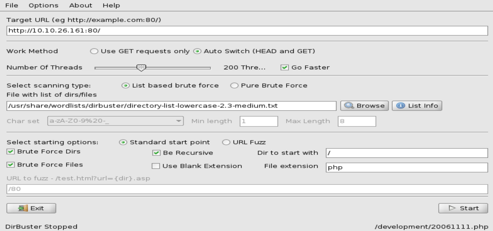

Objective

The purpose of this project is to explore and practice fundamental penetration testing techniques. 

The key objectives are:
Brute Forcing:
Understand and utilize tools to perform password brute-force attacks on various services and systems.

Hash Cracking:
Learn to identify, extract, and crack password hashes using hash-cracking tools (e.g., John the Ripper, Hashcat).

Service Enumeration:
Perform enumeration of services running on a target system to identify potential vulnerabilities.

Target IP: 10.10.26.161

Process
1. Perform nmap scan: nmap -A -T4 -Pn -p- oA thm-basicpentest 10.10.26.161

port 80 is open and in apache server and in a Ubuntu OS.
this would help us see the port by accessing it in the URL.

In the image above we see it has a txt "Undergoing maintenace pleace check back later" 

2. The next step would be is to perform dirbuster
In the image below i use OWASP Dirbuster, i put the target url with the open port 80. in the "File with list of dirs/files i clicked browse to get the "directory-list-lowercase-2.3-medium.txt and click start.

Here in the image below we can see a folder named "/" with a response cocde 200 and after a few more seconds it will show the icons and development folders we will use the development because it has a respnse code 200 as well

Here on the images below after adding "development" on the endpoint of the url we have the index of /development

As we can see we have 2 txt files "dev.txt" and "j.txt"
dev.txt:

j.txt:

On the images theres nothing much to see only a conversation between two people.
but with the person name "J" send by the person "K" is talking about j having a weak credentials and with this we will look for it.

3.On the next step we will see if theres any log ins with this i will use "smbclient" to list out any shares we have access. 
On the images below in the sharename i got anonymous by using "smbclient -L \\10,10.26.161" 

Now to get access to the anonymous. below in the images we can see a txt file named staff.txt what we will do is to get this.

As we cab see we have now a name of the person "jan" and "kay" i will use note and put this and i will use brute force later.

4.Using hydra with this i can perform a brute force on ssh://10.10.26.161

In the images above we got some interesting stuff like in port 22 we have a login for the user jan with his password.

Here on the Images above we have access jan and we can see a bunch of stuff

On the image above i am now jan and now we can explore more. 

We got 2 users we jave access for jan but we dont have access for kay yet.

5.Using this information we will go with the User Kay by going to its directory 

6. using SSH to crack the password making it in a hash with this i can use john the ripper
first is to access ssh

after this on directory ssh we will use "cat id_rsa"

We will use this private key. 

7. nano id_rsa and paste the private key then we will try to crack it using john we will make the id_rsa to hash

There seems to be a problem and we will resolve this

8.The issue here arises because the rockyou.txt.gz wordlist we are using is likely compressed, and John the Ripper cannot process it directly in its current form. Additionally, there is a warning about encoding (UTF-16 BOM).
first step is to unzip it and with this we are using gunzip

9.Checking if the gunzip we perform is successfull by ls and grep

and now its showing just fine

10. now we will hash it again with the rockyou.txt

and now we can see the password

11.On the next step we will change the permission 

on the next step we will remove the read only

changing it by using chmod

12. access it again then use the beeswax password we get earlier

and here we can see the last password and we can now complete the last task.